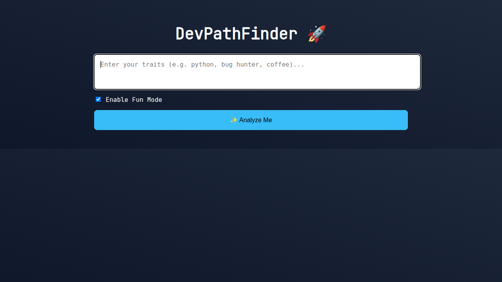
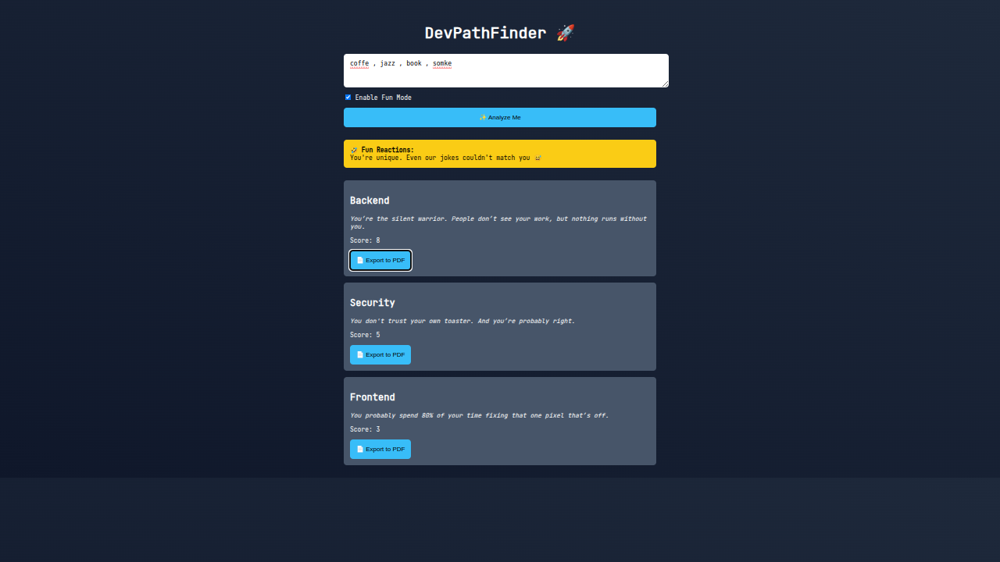

# 🚀 DevPathFinder

**DevPathFinder** is your fun, geeky career compass 🔍 for the dev world.  
Just type a few words about your **personality** or **interests**, and this little wizard will point you toward your best fit in tech: **Frontend**, **Backend**, or **Security** — with a cheeky twist 😆

> _No libraries. No frameworks. Just good ol’ HTML, CSS & JS._

---

## ✨ Features

- 🤖 **Interactive personality analyzer** with a splash of humor  
- 🧠 **Smart scoring system** that ranks roles based on your vibes  
- 🎨 **Clean, dev-style UI** — minimal yet modern  
- 🚀 **Blazingly fast** — no build tools, just raw performance  
- 🎭 **Fun mode** with jokes & sassy reactions  
- 💡 Perfect for **GitHub Pages** hosting  

---

## 🧪 Live Demo

👉 [**Try it now on GitHub Pages**](https://hesamverse.github.io)

---

## ⚙️ How it works

1. Type keywords like: `python`, `css`, `bug hunter`, `coffee addict` ☕  
2. Toggle "Fun Mode" for... well, fun!  
3. Hit `Analyze Me`  
4. Instantly get a dev path + some spicy feedback 🌶️  
5. _(Coming soon: Export to PDF feature!)_

---

## 📸 Screenshots

<table>
  <tr>
    <td></td>
  </tr>
  <tr>
    <td></td>
  </tr>
</table>

---

## 🧭 Dev Role Comparison

| Role       | Key Skills                  | Typical Vibes               | Ideal For You If...                     |
|------------|-----------------------------|-----------------------------|------------------------------------------|
| 🖼 Frontend | HTML, CSS, JS, React        | Creative, visual, user-first | You love making things *look* awesome  |
| ⚙️ Backend  | Python, Node.js, Databases  | Logical, data-driven        | You enjoy making things *work* well    |
| 🛡 Security | Linux, Networking, Hacking  | Curious, skeptical, alert   | You love breaking things... responsibly |

---

## 🎯 Project Goals

This project is part of a broader vision:  
Help **new developers** discover their tech personality, **learn faster**, and actually **enjoy** the journey.

### Next milestones:
- 🔁 Full **React** version with component-based UI  
- 🧾 Export results to **PDF**  
- 🧠 Smarter AI-powered matching via **API**  
- 🌐 Optional **Web3 identity integration**  

---

## 👨‍💻 About the Author

Built with ❤️ by [@hesamverse](https://github.com/hesamverse)  
_A caffeine-powered dev from Isfahan, trying to make the dev world a little more personal._

---
